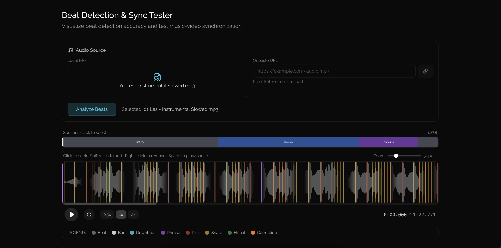

# 🎵 Beat Sync Tester

[](LICENSE)
[](https://www.typescriptlang.org/)
[](https://react.dev/)

> Browser-based beat detection and music analysis tool. Upload audio, visualize beats on an interactive waveform, and export sync data.

I vibecoded this for my own purposes and it turned out way more useful than expected. Sharing in hope that somebody else finds it helpful too.



## ✨ Features

- 🎵 **Beat Detection** — Accurate BPM and beat timing via [essentia.js](https://essentia.upf.edu/essentiajs/) (WASM)
- 🌊 **Interactive Waveform** — Zoomable, scrollable visualization with [wavesurfer.js](https://wavesurfer.xyz/)
- 🥁 **Drum Analysis** — Detects kicks, snares, and hi-hats using FFT spectral analysis
- 🎼 **Section Detection** — Identifies intro, verse, chorus, drop, breakdown, outro
- ✏️ **Manual Corrections** — Add/remove/drag beat markers to fix detection errors
- 📊 **JSON Export** — Copy analysis data for integration with video editors or other tools

## 🚀 Quick Start

```bash
git clone git@github.com:skrrrt-and-boom/beat-sync-tester.git
cd beat-sync-tester
npm install
npm run dev
```

Open [http://localhost:5173](http://localhost:5173) in your browser.

## 📖 How to Use

### 1. Load Audio
Drag & drop an audio file into the drop zone, or paste a URL and press Enter.

### 2. Analyze
Click **"Analyze Beats"** to run the detection algorithm. Analysis takes 2-5 seconds depending on track length.

### 3. Interact with Waveform
Use keyboard shortcuts and mouse to navigate and correct:

| Action | How |
|--------|-----|
| **Play / Pause** | `Space` or click ▶️ button |
| **Seek** | Click anywhere on waveform |
| **Add correction** | `Shift` + Click on waveform |
| **Remove correction** | `Right-click` on a marker |
| **Drag correction** | Click and drag orange markers |
| **Zoom** | Use the zoom slider (top right) |

### 4. Review Results
See detected BPM, sections, and drum patterns:


### 5. Export
Click **"Export JSON"** to copy the full analysis data to clipboard.

## 🎨 Marker Colors

| Color | Meaning |
|-------|---------|
| ⚪ Gray | Regular beat |
| ⚪ White | Bar (every 4 beats) |
| 🔵 Cyan | Downbeat |
| 🟣 Purple | Phrase boundary |
| 🔴 Red | Kick drum |
| 🟡 Yellow | Snare |
| 🟢 Green | Hi-hat |
| 🟠 Orange | Manual correction |

## ⌨️ Keyboard Shortcuts

| Key | Action |
|-----|--------|
| `Space` | Play / Pause |
| `Shift + Click` | Add correction marker at click position |
| `Right-click` | Remove correction marker |

## 🛠 Tech Stack

- **Frontend**: React 19, TypeScript, Tailwind CSS
- **Build**: Vite
- **Audio**: [essentia.js](https://essentia.upf.edu/essentiajs/) (WASM), [wavesurfer.js](https://wavesurfer.xyz/)
- **Analysis**: Web Workers for non-blocking processing

## 📁 Project Structure

```
src/
├── components/          # UI components
│   ├── BeatVisualizerWaveform.tsx
│   ├── AnalysisPanel.tsx
│   ├── SectionTimeline.tsx
│   └── BeatMarkerLegend.tsx
├── services/            # Audio analysis
│   ├── BeatDetectionService.ts
│   ├── beat-detection.worker.ts
│   ├── DrumAnalyzer.ts
│   ├── EnergyAnalyzer.ts
│   └── SectionAnalyzer.ts
├── hooks/
│   └── useBeatCorrections.ts
└── types/
    └── index.ts
```

## 🤝 Contributing

PRs welcome! Feel free to open issues for bugs or feature requests.

## 📄 License

[MIT](LICENSE) — do whatever you want with it.
